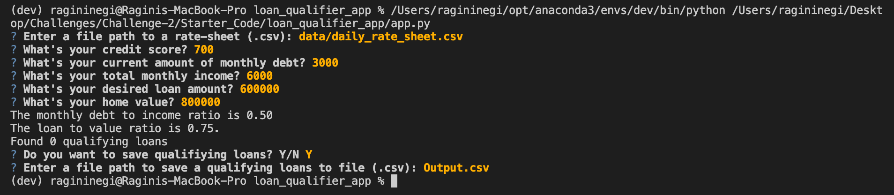

## Loan Qualifier CLI

This is a command-line interface application for matching the applicants with the qualifying loans. We need to add new features and enhancements to the loan qualifier application. This application records the inputs of user and match them with the loan qualifier criteria, based on which the user gets to see the list and details of qualifying loans. 

## Technologies

Python 3.9.7
It supports Python 3.7 and above.
Installed the following libraries:
* questionary - For interactive user prompts and dialogs
* python-fire - For the command line interface, help page, and entry-point.


## Installation Guide

Before running the application first download the whole folder named "loan_qualifier_app" and then install the following dependencies:

```
pip install fire
pip install questionary
```

## Usage

To use this loan qualifier tool follow the below steps:

Check the version of pyhton. It should be version 3.7 and above. To check that use python --version
Run python app.py and follow the questionary to provide the inputs.
For questionary Enter a file path to a rate-sheet (.csv)? you can use file path as Challenge-2/data
For questionary Enter a file path to save a qualifying loans to file (.csv)? Provide the file path where you want to save the output csv file.




## Contributors

* Ragini Negi 
* Email : negiragini16@gmail.com 
* LinkedIN: https://www.linkedin.com/in/ragininegi/


## License
Apache License
